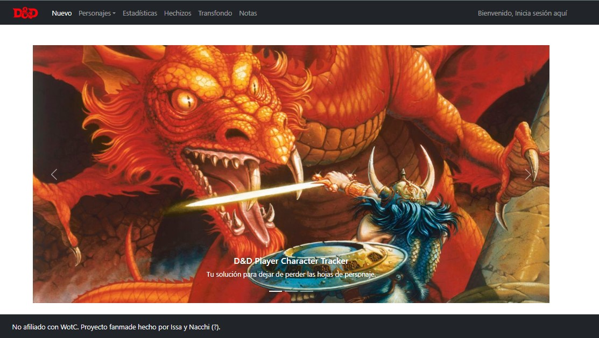
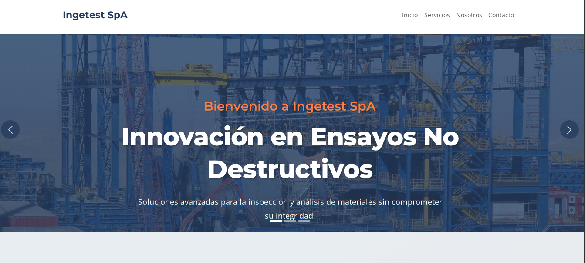

  

HI, HELLO
 

Mi nombre es Issa, soy milenial, chilenx, tecnico en redes, dev Front-End junior y fotografo amateur los fines de semana.
Hago sitios web, le doy muchos besitos a mis michis, saco fotos muy bonitas y le saqué las rueditas a mi bicicleta.

Me gusta mucho el desarrollo de soluciones para mis clientes.
Más me gusta el desarrollar cositas chicas; un robocopy fancy por aquí, un dot file por allá. Por ahi deben estar mis confites de aliases y de mi bashrc.

He trabajado con un montón de cosas, [mirame en linkedin](https://cl.linkedin.com/in/melissa-guala-a309a7210) si es por trabajo 😉

Siéntete libre de echar un vistazo a algunos de mis proyectos existentes:

[Frontend para el consumo de DigimonAPI](https://mguala.github.io/super-broccoli/)

  
[DnD Player Charater Tracker WIP](https://github.com/mguala/fuzzy-pancake) desarrollado en conjunto con [NovaFugaz](https://github.com/NovaFugaz)

  
La web de la empresa [Ingetest](www.ingetest.cl)

