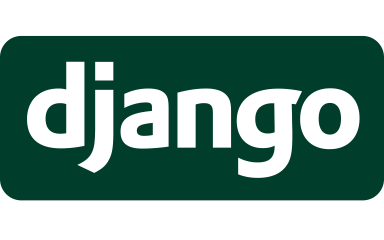

HI, HELLO

I'm Issa, millennial, Chilean, and I'm an IT nerd who likes to play the ukelele on their free time.

I make websites, and a mean roast beef!

I completed a full-stack web-development bootcamp in 2021 with SENCE and am seeking to learn more things, because one always can learn more stuff.

I am a creative personality with a passion for the arts, learning and research. I pride myself on being a person who always is very good at doing their job. I do pay attention to details while also thinking outside of the box.

I have worked with HTML, CSS, Git, Ruby, Rails, JavaScript, Python, Django, APIs and SQL.

<p align="center">
    
    
    
    
    
    
    
    
    
     <br>
    
</p>

</p>

I've worked with other technologies too, JIRA was *fun* to learn. I've used OracleDB, Visual Basic 6.0 (yup), .NET and PHP.

<p align="center">
    
    
    
    
    
</p>    

But I know how to do much more; I have an Associate Degree in Network Systems Administration and I work freelance! Remotely! *with my own T470 thinkpad!* That's grand, isn't it?

I like opensource software and OS, I use Debian with PlasmaKDE because it's useful and it looks pretty enough I don't have to mess with it too much.

[Send me an email](mailto:mgualaa@gmail.com) and tell me about your project, that'll get my attention for sure.
If not, send me one with pictures of cats, or fountain pens; ***that*** will do for sure.

I started coding back in 2009 in pen and paper, so find the missing semicolon was very fun to say the least. I do like learning to code, troubleshooting things are the best thing ever for me. But you know what i love the most? ✨Documentation✨

Feel free to have a look at some of my existing projects:
[project placeholder] 


```sh

```

<!--
To display project linked images in a one row, two column format, generate a table at:
https://tableconvert.com/
