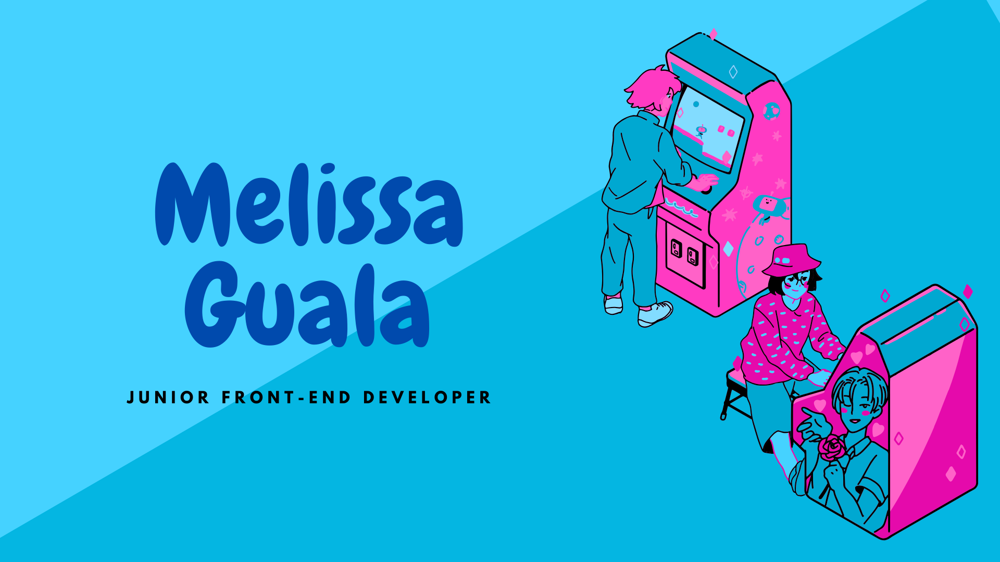
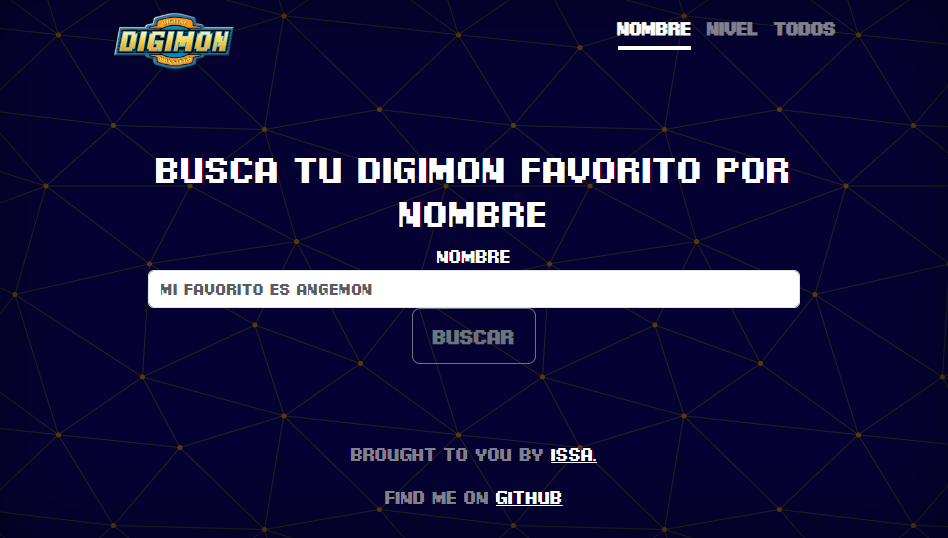
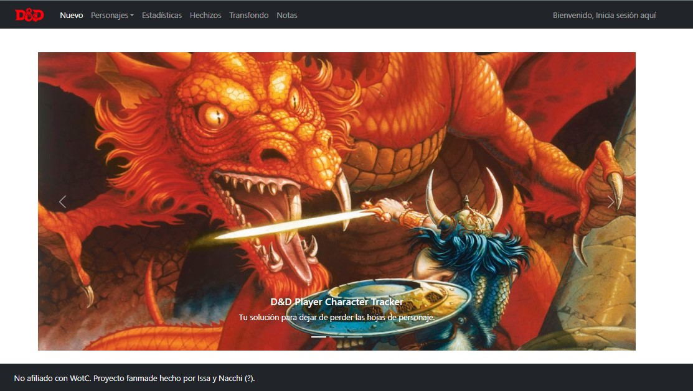
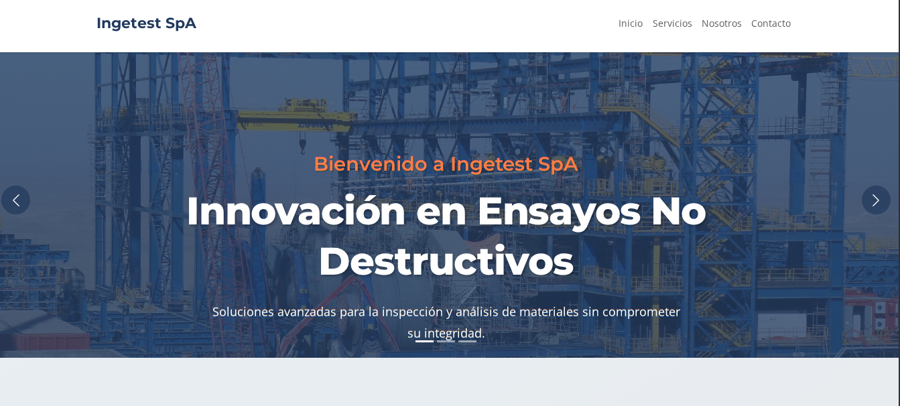

  

HI, HELLO
 
Mi nombre es Issa, soy milenial, de Chile, tecnico en redes, dev Front-End junior y fotografo amateur los fines de semana.

Hago sitios web, le doy muchos besitos a mis michis, saco fotos muy bonitas y le saqué las rueditas a mi bicicleta. Ademas de eso me gusta mucho armar modelos a escala.

Me gusta mucho el desarrollo de soluciones para mis clientes. Los escucho de manera atenta y les consulto por sus preferencias antes wue las mias porque no me sirve quedar contento con mi trabajo si al cliente no le sirve, o no es lo que quiere. Igual me gusta desarrollar cositas chicas; un robocopy fancy por aquí, un dot file por allá. 

Por ahi deben estar mis confites de aliases y de mi bashrc.

Uso void linux como daily driver, me gusta porque en mi x250 funciona super bien y no tengo problemas de rendimiento.

He trabajado con un montón de cosas, [mirame en linkedin](https://cl.linkedin.com/in/melissa-guala-a309a7210) 😉

Hice un [Frontend para el consumo de la DigimonAPI](https://mguala.github.io/super-broccoli/) el 2023 cuando tomé mi segunda certificacion.

  
Con [NovaFugaz](https://github.com/NovaFugaz) el 2023 nos pusimos a desarrollar el [DnD Player Charater Tracker](https://github.com/mguala/fuzzy-pancake) en Django 
 tomando como inspo la web de dnd Beyond

  
El 2025 [reescribí la web](https://github.com/mguala/fuzzy-potato) de la empresa [Ingetest](http://www.ingetest.cl) desde un proyecto en asp a un sitio en html y está en la world wide web. 

Estoy super orgullorso de todo lo que he hecho la verdad. Estoy armando mi portafolio de a poco si, pero [hablemos](mailto:mgualaa@gmail.com) y dime que quieres hacer.

