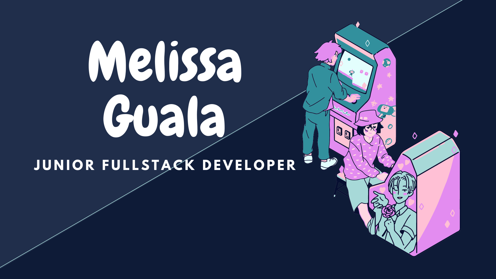

HI, HELLO

Mi nombre es Issa, soy milenial, chilenx y soy un nerd informatico a quien le gusta tocar el ukelele en su tiempo libre.

Hago sitios web, trabajo como admin de bases de datos Oracle *y los tallarines con salsa me quedan super buenos*

El 2022 completé un bootcamp de desarrollo full-stack con SENCE llamado "Emprendimiento digital con Ruby on Rails", y siempre quiero aprender algo nuevo, porque uno siempre puede aprender algo mas. En Agosto 2023 de Desarrollo de aplicaciones con Python, tambien con SENCE.

Soy una persona creativa, me gusta sentarme a programar escuchando musica (en mi playlist conviven Bad Bunny, L'Arc-En-Ciel y Los Jaivas), me gusta aprender cosas nuevas.
Me enorgullezco de decir que soy una persona a quien siempre le ha gustado hacer su trabajo. Me gusta prestarle atencion a los detalles siempre pensando fuera de la normalidad.

He trabajado con HTML, CSS, JavaScript, Git, Ruby, Rails y bases de datos relacionales (SQL y OracleDB). Desarrollo en VS Code y me gusta mantener un control de versiones en GitHub

    
    
    
    
    
    
    
    
    

    

Pero se hacer muchas cosas mas; me gradué de Tecnico Superior en Administracion y Soporte De Redes y trabajo freelance! Remotamente! *con mi propio Thinkpad T470.* Eso es grandioso, no?

Me gusta el software y el sistema operativo de código abierto, uso Debian con PlasmaKDE porque es útil y se ve lo suficientemente bonito como para no tener que jugar demasiado con él.

Empecé a codificar en 2009 con lápiz y papel, así que encontrar el punto y coma que faltaba fue muy *divertido*, por decir lo menos.

Me gusta escribir codigo y solucionar problemas es lo mejor para mí. 
¿Pero sabes lo que más amo? ✨La documentación✨

[Envíame un correo electrónico](mailto:mgualaa@gmail.com) y cuéntame sobre tu proyecto, seguro que me llamará la atención.
Si no, envíame uno con fotos de gatos o plumas estilográficas; *eso* servirá con seguridad.

Siéntete libre de echar un vistazo a algunos de mis proyectos existentes:

[Frontend para el consumo de DigimonAPI](https://mguala.github.io/super-broccoli/)

[Frontend para el consumo de DigimonAPI](https://mguala.github.io/super-broccoli/)

